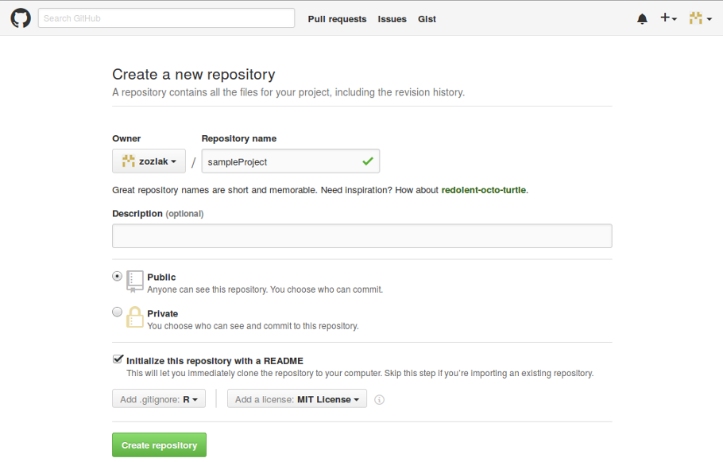

```{r, echo = FALSE, results = 'hide'}
suppressMessages(library('sampleProject', quietly = TRUE))
```

# Prerequisites

## Software

- (surprisingly) [R](http://cran.at.r-project.org/)
- [RStudio](https://www.rstudio.com/products/rstudio/download/)
- [git](https://git-scm.com/downloads) or [GitHub git client](https://desktop.github.com/)
- [Rtools](https://cran.r-project.org/bin/windows/Rtools/) - only Windows users

### R packages

- devtools - really don't know how people managed to develop R packages without it
- testthat - for automatic testing
- covr - for tests coverage reports
- dplyr - we will use it in our example function

```{r, eval = FALSE}
install.packages(c('devtools', 'testthat', 'covr'))
```

## Accounts

- [GitHub](https://github.com/) - git hosting with many useful features (issue tracker, wiki, external tools, e.g. continues integration systems)
- [Travis](https://travis-ci.org/) - continues integration system working with GitHub (so get a GitHub account first)
- [Coveralls](https://coveralls.zendesk.com/hc/en-us) - code coverage reporting system working with GitHub (so get a GitHub account first)

# Create a project

## Create new GitHub repository

Log into [GitHub](https://github.com/) and create a new repository (click the plus sign in the top-right corner and choose _New repository..._)

- Give it a name, 
- Choose it to be public, 
- Check _Initialize this repository with a README_
- Choose _R_ from _Add .gitignore_
- Choose _MIT License_ (or any other) from _Add a license_
- Click _Create repository_



- copy your repository clone URL - it will be needed in the next step


## Create and configure RStudio project

### Create RStudio project from the GitHub repository

- Open RStudio
- Choose menu _File->New Project..._
- Choose _Version Control_
- Choose _Git_
- Paste your repository clone URL (see previous chapter) into _Repository URL_
- Choose a directory
- Click _Create Project_

### Configure your RStudio project

- Choose menu _Tools->Project Options..._
- Go to _General_
    - Choose _No_ in all cases (we are developing a package, so there should be no automatically created session data there)
- Go to _Build Tools_
    - In _Project build tools_ choose _Package_
    - Check _Generate documentation with Roxygen_
        - Make sure all entries in the _Automatically roxygenize when running:_ are checked
- Close window by clicking _OK_ (RStudio will reload your project)
- Create file _.Rbuildignore_ in the root directory of your project  
  (it contains a list of files which should be omitted during package build)  
  Fill it with:
    ```{r, eval = FALSE}
    ^.*\.Rproj$
    ^\.Rproj\.user$
    ^.travis.yml$
    ```
- Add a line _\*.Rproj_ to  file _.gitignore_  
  (we don't want to include our RStudio project file in the repository)

## Initialize an R package

- Initialize package skeleton  
  (this will generate an _R_ directory and a _DESCRIPTION_ file)  
  (we are using _rstudio = FALSE_ parameter, because RStudio project files are already created)
    ```{r, eval = FALSE}
    devtools::setup(rstudio = FALSE)
    ```
- Edit the _DECRIPTION_ file:
    - Fill in _Title_ and _Description_  
      (title text should be in title case, e.g. _My Sample Project_ instead of _My sample project_)  
      (description text should contain a full stop at the end)  
    - Fill in _Authors\@R_ (replace _First_ and _Last_ and a sample email with your name, surname and email, leave  _role_ as it is)
    - Put your license name followed by _+ file LICENSE_ in the _License_ field (compare screenshot below)
    - If you plan to use functions from other packages, put their names (and, if required, versions) as a comma-separated list in the _Import_ field (compare screenshot below)
    
- Go to tab _Build_ and click _Check_ (or simply hit _CTRL+SHIFT+E_)  
  A lot of messages will be displayed but the final one should be _R CMD check succeeded_  
  Moreover you should see no more then one warning (the one we can expect is _checking PDF version of manual ... WARNING_ and is connected with the fact we do not have LaTeX installed on our computer)  
  Congratulations! You have just built your first R package (an empty one, but anyway)

## Set up testing and continues integration

- Set up directory structure for tests
  (directory _tests_ with some content will be created)
    ```{r, eval = FALSE}
    devtools::use_testthat()
    ```
- Enable Coveralls for your repository
    - Log into Coveralls at https://coveralls.io
    - Go to https://coveralls.io/repos/refresh - you will see a list of your GitHub repositories
    - Turn on Coveralls for your new repository
      
- Add the _covr_ package to the _Suggests:_ section of you _DESCRIPTION_ file
- Set up a continues integration with code coverage checks
    - Create file _.travis.yml_ in the root directory of your project  
      Fill it with:  
      (adjust the notification email)
        ```{r, eval = FALSE}
        # http://docs.travis-ci.com/user/languages/r/
        language: r

        sudo: required

        after_success:
          - Rscript -e 'library(covr);coveralls()'
  
        warnings_are_errors: false

        notifications:
          email:
            - your@email
        ```
        - if your package depends on packages available on GitHub but not on CRAN, add a section:
            ```{r, eval = FALSE}
            r_github_packages:
              - user1/repoName1
              - user2/repoName2
            ```
    - Log in to Travis at https://travis-ci.org/
    - Go to https://travis-ci.org/profile/ 
    - Turn on Travis for your new repository
        - If you can not see your repository on the list, you may refresh the list with the _Sync_ button
      
- Add Travis and Coveralls badges to your package _README.md_ file:  
  (adjust your login and repository name in URLs) 
  (you can also copy badges code from Travis/Coveralls web sites)
    ```{r, eval = FALSE}
    # sampleProject
      
    [](https://travis-ci.org/zozlak/sampleProject)
    [](https://coveralls.io/github/zozlak/sampleProject?branch=master)
    ```
        
## Commit your changes

- Open the _Git_ tab in the RStudio (see the screenshot)
- Check all files in the _Staged_ column  
- Click the _Commit_ button
  
- Provide a commit description in the _Commit message_ text field
- Click the _Commit_ button  
  
- Close the window summing up your commit.
- Push your commit to the GitHub by clicking the _Push_ button
    (if for some reason RStudio is unable to push the commit for you, please do it externally using your favorite git shell)

# Create a simple function

Now lets create a simple function which will take two arguments and return average value of the first one grouped according to values of the second one

## Create a file with function source code

Create file _myFunction.R_ in the _R_ directory with a following content:

```{r, eval = FALSE}
myFunction = function(values, groups){
  result = data.frame(value = values, group = groups) %>%
    group_by_('group') %>%
    summarize_(avg = ~mean(value, na.rm = TRUE))
  return(result)
}
```

Remarks:

- you can use any file name you want but it is easier to find your function if a name of the file is the same as function name
- you can put many functions into one file but I find it easier to manage my source code if I create one file per function

## Provide documentation

We will use [Roxygen](https://cran.r-project.org/web/packages/roxygen2/vignettes/rd.html) syntax.  
The easiest way to introduce it will be an example, so lets look at the _myFunction.R_ after adding documentation in a Roxygen syntax:

```{r, eval = FALSE}
#' Computes means by groups
#' @description
#' You can put extended description here
#' @details
#' If your function is complicated, you may consider adding a details section
#' @param values numeric vector of values
#' @param groups vector of groups
#' @return data.frame with groups names in first column and average values per group in the second one
#' @export
#' @import dplyr
myFunction = function(values, groups){
  result = data.frame(value = values, group = groups) %>%
    group_by(group) %>%
    summarize(avg = mean(value, na.rm = TRUE))
  return(result)
}
```

Remarks:

- _\@description_ and _\@details_ sections are optional
- _\@param_ has syntax _\@param argumentName argument description_
- _\@return_ has no formal syntax (but I prefer to denote returned value type followed by detailed description)
- _\@export_ means your function should be visible to package users (in opposite to functions which are used only internally)
- _\@import_ has syntax _\@import packageName_ and means that you are using functions from a given R package in your function
    - instead of using _\@import_ you can explicitly declare namespace for functions from other package (e.g. write _dplyr::group_by()_ instead of simply _group_by()_)
    - if you want to submit your package to CRAN, take a while to read more on this topic, e.g. in Hadley's publications  [here](http://r-pkgs.had.co.nz/description.html#dependencies) and [here](http://r-pkgs.had.co.nz/namespace.html#imports) as well as in the [Writing R Extensions](https://cran.r-project.org/doc/manuals/r-release/R-exts.html#Package-Dependencies)


## Check if function works

- Hit _CTRL+SHIFT+L_ to install and load package  
  (it is something like _install.packages(myPackage)_ followed by _library(myPackage)_ but of course your package is installed from local source and not from CRAN)  
  (you can also click the _Build & Reload_ button in the _Build_ tab)
- Run your function on sample data:
    ```{r}
    myFunction(1:10, rep(1:2, each = 5))
    ```
- Check automatically created documentation:
    ```{r}
    ?myFunction
    ```

# Create a simple test

## User-defined tests

We will use the [testthat](r-pkgs.had.co.nz/tests.html) library to prepare tests.

- Create file _tests/testthat/test-myFunction.R_:
    ```{r, eval = FALSE}
    test_that('my first test', {
      expect_equal(
        myFunction(1:10, rep(1:2, each = 5)),
        data.frame(group = c(1, 2), avg = c(3, 8))
      )
    })
    ```
  Remarks:
    - Each file containing test should be put in the _tests/testthat_ directory and its nave have to begin with _test-_
        - its up to you, how you divide your tests among files
    - Each test file contains one or more group of tests. A group is denoted by a _test_that()_ function call which takes to arguments - group name and the R code performing tests.
    - In each group you are using different _expect_...()_ functions to check if your package behaves as expected  
      (technically we call such single tests _assertions_ or _expectations_)
- Run your tests by hitting _CTRL+SHIFT+T_  
  (this will run all tests in your project)  
  (of course you can also run single tests manually by marking their source and hitting _CTRL+ENTER_)
- You should get something like:
    ```{r, eval = FALSE}
    Loading sampleProject
    Loading required package: testthat
    Loading required package: dplyr
        
    Attaching package: ‘dplyr’
    
    Następujące obiekty zostały zakryte z ‘package:stats’:
        
        filter, lag
        
    Następujące obiekty zostały zakryte z ‘package:base’:
        
        intersect, setdiff, setequal, union
        
    Loading required package: ggplot2
    Testing sampleProject
    1
    1. Failure (at test-myFunction.R#2): my first test -----------------------------
    myFunction(1:10, rep(1:2, each = 5)) not equal to data.frame(group = c(1, 2), avg = c(3, 8))
    Incompatible type for column group: x integer, y numeric
    ```
- Lets fix our test according to the error message (by providing the _group_ variable as an _integer_ data type):
    ```{r, eval = FALSE}
    test_that('my first test', {
      expect_equal(
        myFunction(1:10, rep(1:2, each = 5)),
        data.frame(group = c(1L, 2L), avg = c(3, 8))
      )
    })
    ```

# R package tests

Besides tests provided by you R can perform his own tests on your package code.  
Among them there are as useful ones as checking for undefined variables and functions (a curse of R developers).  
As these are more advanced topics and your package will still work even R package tests rise some NOTEs or even WARNINGs on it you can skip this section if you find it to difficult (but if you want to put your package in CRAN at some point you will have master them anyway).

- Hit _CTRL+SHIFT+E_ (or go to the _Build_ tab and click _Check_ button) to trigger package check
  (note that tests provided by you in the previous chapter are also executed)
- Among check results you should find:
    ```{r, eval = FALSE}
    * checking R code for possible problems ... NOTE
      myFunction: no visible binding for global variable ‘group’
      myFunction: no visible binding for global variable ‘value’
    ```
  This message is caused by the fact that we are trying to use undeclared variables _group_ and _value_ in our function.  
  In this case it is not an error because dplyr uses a technique called [non-standard evaluation](http://adv-r.had.co.nz/Computing-on-the-language.html) but:
    - you should read such messages carefully and check if it is really an expected behavior
    - developing packages you should avoid non-standard evaluation and rather write your function like that:
        ```{r, eval = FALSE}
        #' Computes means by groups
        #' @description
        #' You can put extended description here
        #' @details
        #' If your function is complicated, you may consider adding a details section
        #' @param values numeric vector of values
        #' @param groups vector of groups
        #' @return data.frame with groups names in first column and average values per group in the second one
        #' @export
        #' @import dplyr
        myFunction = function(values, groups){
          result = data.frame(value = values, group = groups) %>%
            group_by_('group') %>%
            summarize_(avg = ~mean(value, na.rm = TRUE))
          return(result)
        }
        ```

# See how it works

At the moment we should have an R project configured to work with Travis and Coveralls with a sample function and tests.  
No lets try to see a continues integration at work.

- Check your package by hitting _CTRL+SHIFT+E_ - there is no point in committing a code which has errors
- Commit and push your code to the GitHub
  (you may notice a new _man_ directory and the _man/myFunction.RD_ file in it - this is a documentation generated automatically from your Roxygen comments)
- Open your repository package site on the GitHub and click on the build badge  
  You will be redirected to the Travis build page and can track a progress of your build  
  (be aware that it may take up to few minutes before Travis will find out about your commit and start your build)    
  (the build can take a few minutes so please be patient)
- If your build was successful, open your repository package site on the GitHub and click on the coverage badge  
  You will be redirected to the Coveralls page and can check your code coverage
- Everybody can install your package:
    ```{r, eval = FALSE}
    devtools::install_github('yourLogin/yourRepository')
    ```
